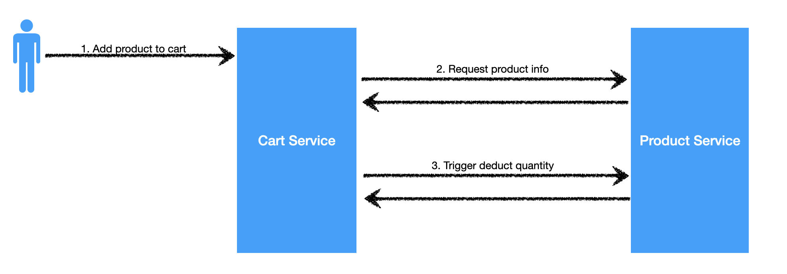
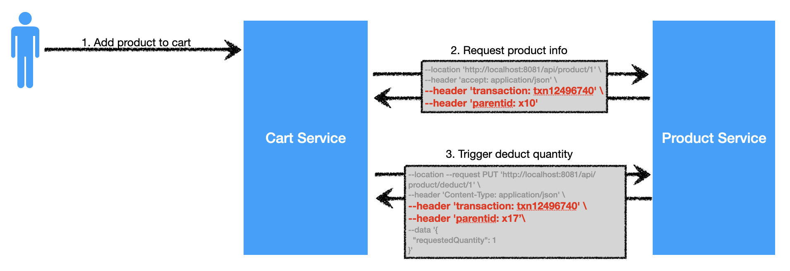
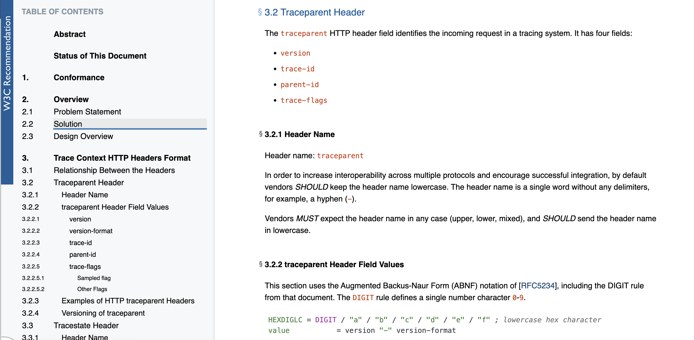
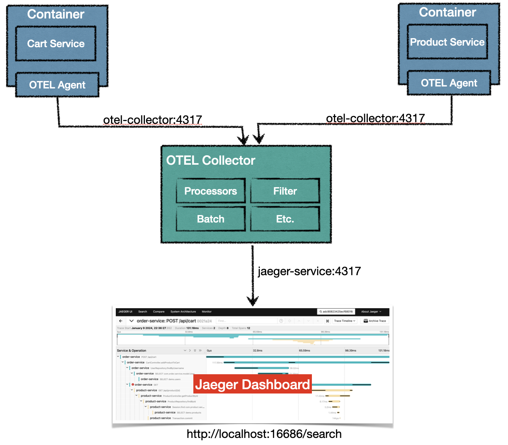

## Introduction
In my previous [spring-boot-otel-jaeger](https://github.com/santipabWannakiri/spring-boot-otel-jaeger) POC project, I utilized Spring Boot with OpenTelemetry, incorporating the configuration of the Otel Collector and Jaeger dashboards. This project provides a comprehensive overview of the advantages of adopting OpenTelemetry, particularly in the realm of tracing. While it successfully establishes the foundation for understanding OpenTelemetry, there is still a crucial core concept that requires attention – `Context Propagation`. Consequently, my focus for this POC project will be on the seamless setup of the end-to-end project, followed by a demonstration of how context propagation operates and its impact on the overall results.

## Distributed tracing
<p align="center">
  
</p>

### Interaction Between Cart and Product Services
The presented illustration depicts a collaborative interaction between two services: Cart and Product. The sequence begins with the following steps:

#### 1. User Clicks "Add to Cart"
   - The user initiates the action by clicking "Add to Cart."

#### 2. Cart Service Requests Product Info
   - Cart service calls Product service to retrieve product information (HTTP GET).
   - Product service responds with product details.
   - Cart service internally validates the received product information.

#### 3. Deduct Quantity Request
   - If the validation is successful, Cart service requests quantity deduction from Product service (HTTP PUT).
   - Product service deducts the quantity and responds.
   - Cart service updates the cart based on the response.
   - Cart service notifies the user of success/failure.

In the given scenario, envision a user-initiated transaction navigating through numerous services before yielding a result. Picture having 5 or 10 services involved; in the event of an error during the transaction, the investigation process could become highly challenging. This is where the pivotal concept of `distributed tracing` comes into play – it serves as the key to monitoring and visualizing request flows across diverse components within a distributed system.

## Context propagation
For distributed tracing to function properly, we rely on something called `Context propagation`.\
`Context propagation` is a key part of distributed tracing that ensures smooth tracking of information as a transaction moves through its entire journey. This helps a lot when we need to keep an eye on what's happening and fix any issues.

The fundamental principle of context propagation is straightforward: we must transmit context information from the initial service to each subsequent service until the entire flow is executed. This context may manifest as a transaction number or any unique identifier. 

To enhance comprehension, refer to the visual representation below.
<p align="center">
  
</p>

The picture above corresponds to a previous example of a service. You'll notice that we have added header fields as follows:
- `transaction` identifier serves as a unique label that must be transmitted through every service involved in the workflow of a transaction.
-  `parentid` establishes a hierarchical structure, indicating which span or operation is the parent of the current one.

## Interoperability challenges
In the absence of a universally accepted standard for context propagation, integrating systems from different vendors can pose challenges. This lack of standardization may result in difficulties ensuring seamless context propagation, potentially leading to issues in tracing, monitoring, and comprehending the flow of requests within a distributed system.

For example, we have 2 vendors that provide the way to implement context propagation in different

#### Vendor A:
Context Propagation Headers:\
A-Transaction-ID: a1b2c3d4-1234-5678-9abc-def012345678\
A-User-Context: user123\
A-Service-Identifier: serviceA

#### Vendor B:
Context Propagation Headers:\
Request-ID: 9876\
B-Client-Info: {"clientID": "client456", "location": "US"}\
B-Session-ID: sessionB

In the scenario of implementing 2 microservices, one from VendorA and the other from VendorB, attempting to establish context propagation between them becomes challenging.\
This difficulty arises due to the notable differences in header field names and even data formats used by each service. Consequently, achieving seamless communication and context exchange between these microservices becomes impractical, highlighting the need for standardized practices to enhance interoperability.

## W3C Trace Context and OpenTelemetry: Industry Standards for Enhanced Context Propagation
<p align="center">
  
</p>

To address these challenges and promote interoperability, the industry has embraced standards such as W3C Trace Context and OpenTelemetry. OpenTelemetry, a widely adopted observability framework, adheres to the W3C Trace Context standard, providing a common framework for context propagation. Given this alignment, it is recommended to leverage OpenTelemetry when tracing microservices. By doing so, organizations can benefit from a standardized approach, ensuring consistency and compatibility in distributed tracing practices across diverse microservices and components.

Refer :\
[W3C Recommendation](https://www.w3.org/TR/trace-context/)\
[OpenTelemetry Context Propagation](https://opentelemetry.io/docs/concepts/context-propagation/#propagation)


## How does the Opentelemetry work ?


##  Project Overview
<p align="center">
  
</p>

To set up this POC project, we will follow the illustration above. The key components include:

### Application Layer:

- Two services, Cart service, and Product service, both developed based on Spring Boot.

### OTEL Backend:

- Utilizing the OTEL collector to collect context propagation from the application layer.

### Visualization:

- Jaeger will be used to visualize context propagation stored within the Otel collector.

### Key Details:

- **Instrumentation Method:**
  - [Automatic Instrumentation](https://opentelemetry.io/docs/instrumentation/java/automatic/) will be employed, leveraging OpenTelemetry's capabilities for effortless trace and metric collection.

- **Containerization:**
  - The entire project will be packaged into containers for seamless deployment and isolation.

- **Docker-Compose:**
  - Docker-compose will be used to initiate the project. Configuration details are specified within the docker-compose file.

- **Endpoints:**
  - Endpoint services will be accessible based on configurations in the docker-compose file. Ensure to document and share these endpoints for testing and interaction.


##  How to run project ?

####  1. Build Cart&Product service
* Clone project
* Complie Cart service
```mvn
cd spring-boot-order-service
mvn clean install
 ```
* Complie Order service
 ```git
cd spring-boot-product-service
mvn clean install
 ```
####  2. Build Cart&Product service as container
* Build Cart service as a container
 ```docker
docker build -f ./OrderServiceDockerfile -t app/spring-boot-order-service .
 ```
* Build Prodict service as a container
 ```docker
docker build -f ./ProductServiceDockerfile -t app/spring-boot-product-service . 
 ```
####  3. Run docker compose
* Start up all components
 ```docker
docker compose -f ./docker-compose.yaml up -d
 ```

####  4. Checking components
Before we test the service, we need to check that all the services are running by the following:
* Cart service Swagger
 ```url
http://localhost:8080/swagger-ui/index.html
 ```
* Product service Swagger
 ```url
http://localhost:8081/swagger-ui/index.html
 ```
* Jaeger Dashboard
 ```url
http://localhost:16686/search
 ```

#### 5. Testing Service
To testing context propagation, I would like suggest you to get back and take a look on application flow. 
We're going to follow step below for testing.

* Call Product service for checking available product
 ```curl
curl -X 'GET' \
  'http://localhost:8081/api/products' \
  -H 'accept: */*'
 ```

* Call Cart service for adding product to cart
 ```curl
curl -X 'POST' \
  'http://localhost:8080/api/cart' \
  -H 'accept: */*' \
  -H 'Content-Type: application/json' \
  -d '{
  "productId": 1,
  "username": "santipab",
  "quantity": 10
}'
 ```

* Call Cart service to check the product ID 1 to see if the quantity is deducted.
 ```curl
curl -X 'GET' \
  'http://localhost:8081/api/product/1' \
  -H 'accept: */*'
 ```

* Navigate to Jaeger Dashboard
 ```url
http://localhost:16686/search
 ```
* On Service menu select 'order-service'
* Click 'Find Traces'
* You should see the trace name like 'order-service: POST /api/cart' then click it
* You should see the trace name like 'order-service: POST /api/cart' 

  
[Distributed tracing](https://engineering.dynatrace.com/open-source/standards/w3c-trace-context/)\
[What is OpenTelemetry? A Straightforward Guide](https://www.aspecto.io/blog/what-is-opentelemetry-the-infinitive-guide/)
